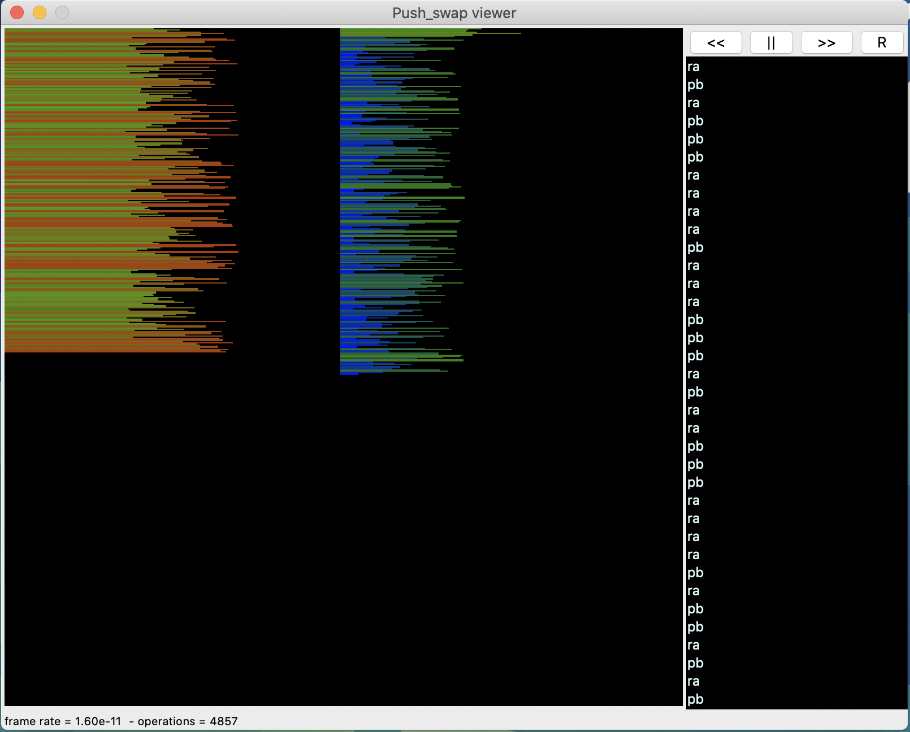

# push_swap
Sorting data on stack with limited set of instructions, and finding the best optimized code to sort smallest count of moves.

#### Skills
- Rigor
- Unix
- Algorithms & AI
- Imperative programming


## 🛠️ Usage

**Follow the steps below**

### Instructions

**1. Clone the repository from github**

```bash
git clone https://github.com/kpaxlive/push_swap.git && cd push_swap/
```
**2. Compile the library by Makefile**
To compile the library, go to its path and run:

For all mandatory and bonus functions:

```bash
 make
```

**3. On the same directory run the following command:**
```bash
./push_swap "<random numbers>"
```

**Example of usage**
<p align="center">
  
</p>  
